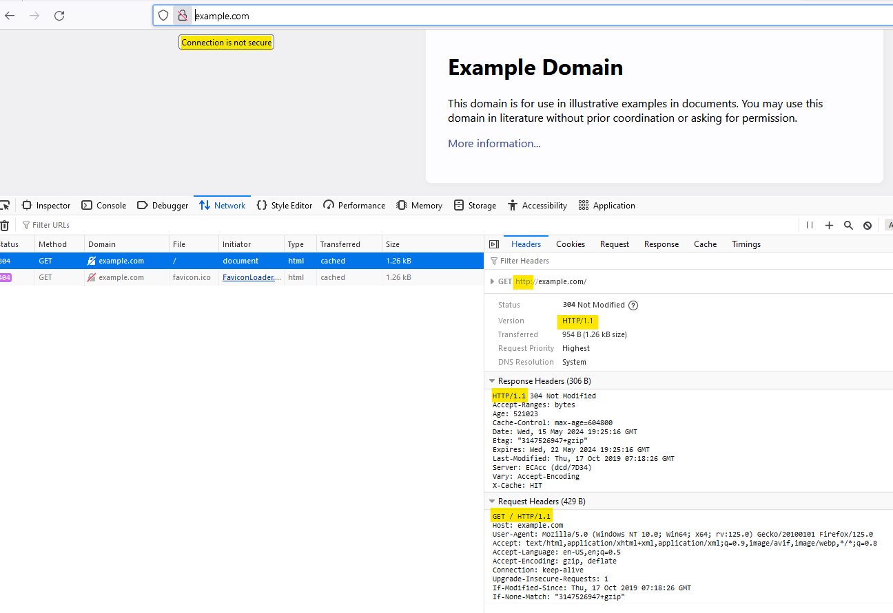

## HTTP Sürümleri


```
http/1.1 = HTTP/1.1
h2       = HTTP/2
h3       = HTTP/3
```

`curl` Belirli bir web sitesinin `HTTP/2` protokol desteğine sahip olup olmadığını öğrenmek için bu komutu kullanabilirsiniz. 
Aşağıdaki örnekte, https://www.cloudflare.com/HTTP/2 desteğini kontrol etmek istediğiniz URL'yi yazmanız yeterlidir:

`% curl -vso /dev/null https://www.cloudflare.com/ 2>&1 | grep ALPN`
Eğer şöyle bir çıktı görürseniz:

* `ALPN: offers h2,http/1.1`
* `ALPN: server accepted h2`

- `offers h2,http/1.1` web sitesinin sunucusu tarafından `HTTP/2` protokol desteği verildiği anlamına gelir.
- `server accepted h2` Web sunucusunun `HTTP/2` kullanmayı kabul ettiği anlamına gelir.

`ALPN`, `HTTP/2`'nin kullanması beklenen `TLS` uzantısıdır.

Lütfen şunu da unutmayın:

`curl`, HTTPS üzerinden `HTTP/2` kullandığında, spesifikasyonun gerektirmesine rağmen kendisi TLS 1.2 veya üzeri konusunda ısrar etmez. Kullanıcı bu sürüm gereksinimini `--tlsv1.2` ile zorlayabilir.

Ayrıca `--http2-prior-knowledge` veya `--http2` bayraklarını da kullanabilirsiniz. Bu sayede http 1.1 ile sunucuyla konuşmak yerine doğrudan http2 isteğini göndermiş olursunuz.


### HTTP 1.1
http://example.com adresine HTTP 1.1 ile istek yapıyoruz ve sunucu cevabında HTTP 1.1 geliyor



### HTTP/2
HTTP/2 size bir dizi bağımsız veri çerçevesi olan akışlar sunar ve bunlar diğer tarafta yeniden birleştirilir. Bu özellik aynı zamanda gecikmeyi de azaltarak performansınızı artırır. Ayrıca farklı verileri yazmak ve okumak için ihtiyaç duyduğunuz sayıda akış açabilirsiniz. 

Uygulanmasıysa, müşterinin belirli veri akışlarına tercih vermesine olanak tanır. Sunucu, istemciden gelen bu talimatları takip etmek zorunda olmasa da, mekanizma, sunucunun, son kullanıcı gereksinimlerine göre ağ kaynağı tahsisini optimize etmesine olanak tanır. 

Ayrıca http isteklerinizin başlık verilerini (headers) sıkıştırma yeteneği sağlar. Başlık sıkıştırmaya basit ve güvenli bir yaklaşım olarak *HPACK spesifikasyonunu* kullanır. Hem istemci hem de sunucu, önceki istemci-sunucu isteklerinde kullanılan başlıkların bir listesini tutar. 

HTTP/2'yi sunucularda sertifika kullanmadan kullanabilirsiniz.

`http2.connect` açılır ve dönüş soketi (http2 oturumu) bu oturumun içinde akışları açabilirsiniz

### HTTP 3


```sh
curl -v --http2-prior-knowledge -X 'POST' 'http://10.10.23.53:8207/oauth2/token' -d 'afId=Netflix&grant_type=client_credentials&scope=3gpp-monitoring-event' --socks4 localhost:6000
```

```sh
curl -v --http2-prior-knowledge -X 'POST' 'http://10.10.23.53:8207/oauth2/token' -d 'afId=Netflix&grant_type=client_credentials&scope=3gpp-monitoring-event' --socks4 localhost:6000
```

### Kaynaklar
- [Microservices HTTP/2 communication in node js](https://medium.com/@alexanderbidiuk/microservices-http-2-communication-in-node-js-30532078812b)
- [Making Synchronous HTTP Requests in Node.js](https://usefulangle.com/post/170/nodejs-synchronous-http-request)
- [Sending synchronous HTTP requests with Node.js](https://medium.com/@shangrz/sending-synchronous-http-requests-with-node-js-f3f91bcfba9f)
- [Neden http/2 seçmelisiniz](https://www.f5.com/company/blog/nginx/7-tips-for-faster-http2-performance)
- [Derinlemesine http/2](https://undertow.io/blog/2015/04/27/An-in-depth-overview-of-HTTP2.html)
- [http/2 Sunucu kodlamak](https://python-hyper.org/projects/h2/en/stable/basic-usage.html)