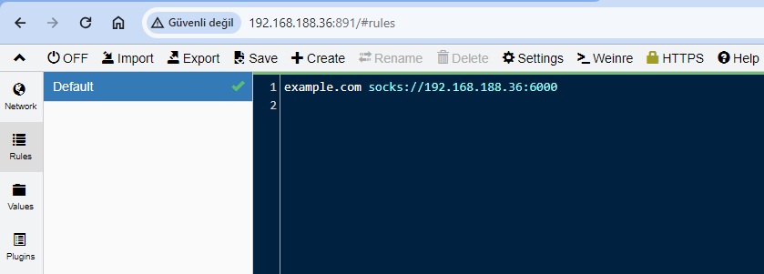
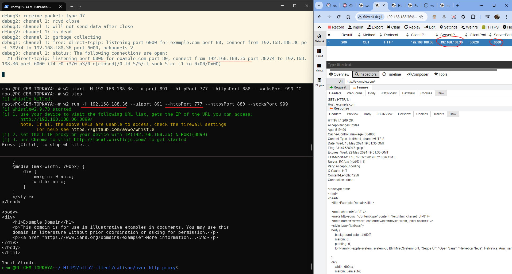

## Whistle Vekil Sunucusunu Ayaklandıralım

```sh
w2 run -H 192.168.188.36 --uiport 891 --httpPort 777 --httpsPort 888 --socksPort 999
```

Vekil sunucu içinde kural ekleyerek gelen isteği socks vekil sunucu üzerine yönlendirebiliriz. Bunun için önce ssh ile socks köprüsü oluşturacağız.



```shell
ssh -D <port numarası> <kullanıcı adı>@<uzak sunucu adresi>
```


```sh
node http_client-over-http_proxy.js
```


